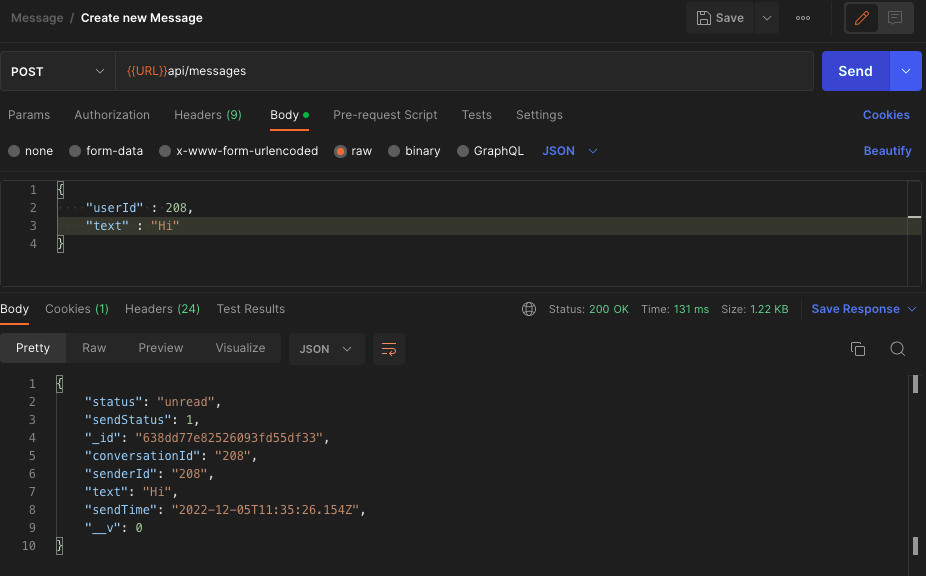
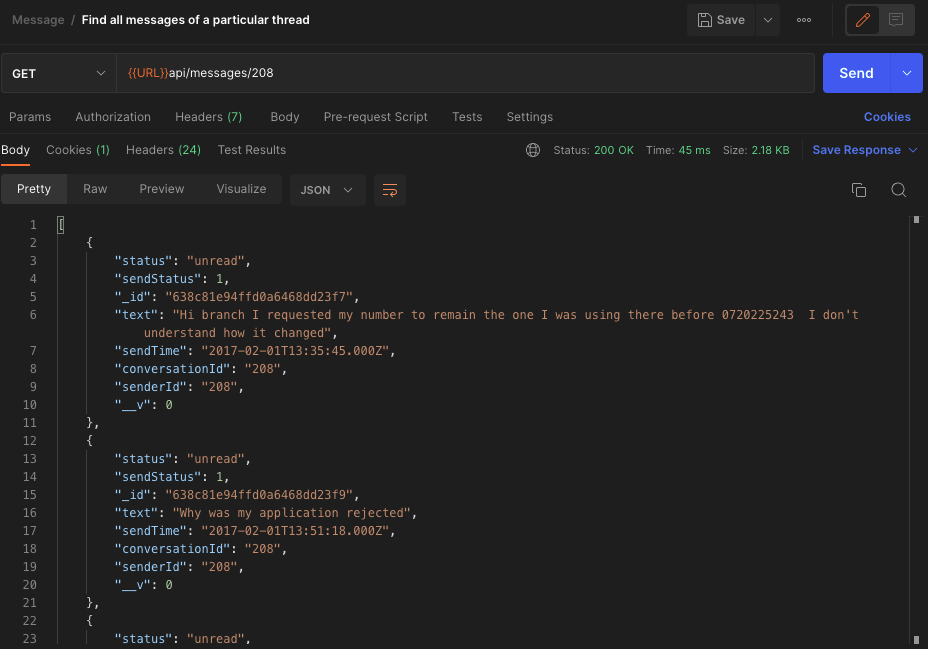

# Features added

- Added feature for customer to send message to multiple agents
- Saved the given dataset in mongodb database
- Added endpoint for simulating a customer request in streamlined fashion
- Added socket.io for real time communication between customer and agent

## Endpoints

### Messages

- /api/messages
  method: POST
  body: {
  "text": "Hello",
  "userId" : 208,
  }
- /api/messages/:id
  method: GET
  description: Get all messages of particular thread
- /api/messages/:id
  method: Post
  description: Simulate request from customer using predefined dataset

### Thread

- /api/threads
  method: GET
  description: Get all threads

- /api/threads/:id
  method: POST
  description: Create a new thread for a particular customer

- /api/threads/:id
  method: GET
  description: Get all thread of a particular thread

### Users

- /api/users
  method: GET
  description: Get all users

- /api/users/
  method: POST
  body: {
  "userID" : 125,
  "role" : "customer" | "agent
  }
  description: Create a new user with specified role

### API Examples

